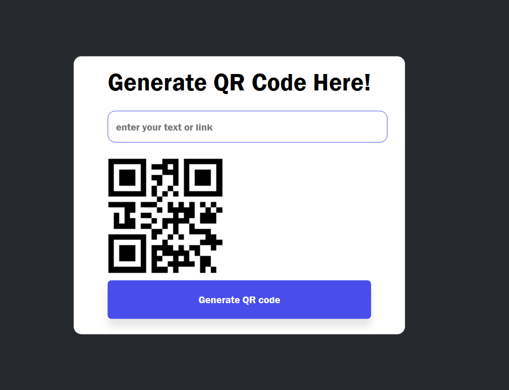

QR Code Generator

This project is a simple QR code generator for text or links, created using HTML, CSS, and JavaScript. The project uses a public API to generate the QR code based on user input. It is designed as a practice project for learning JavaScript.

Features

- Generate QR codes for plain text or email addresses.
- User-friendly interface built with HTML and CSS.
- Real-time QR code generation based on input.

Tech Stack

- HTML: For structuring the page.
- CSS: For styling the user interface.
- JavaScript: For handling logic and making API requests.
- QR Code API: Used to generate QR codes.

Usage

- Enter text or an email address into the input field.
- Click the "Generate QR Code" button.
- A QR code representing your input will be generated and displayed on the page.
- You can download the QR code as an image by right-clicking on it and selecting "Save Image As...".

Screenshot of Project:

